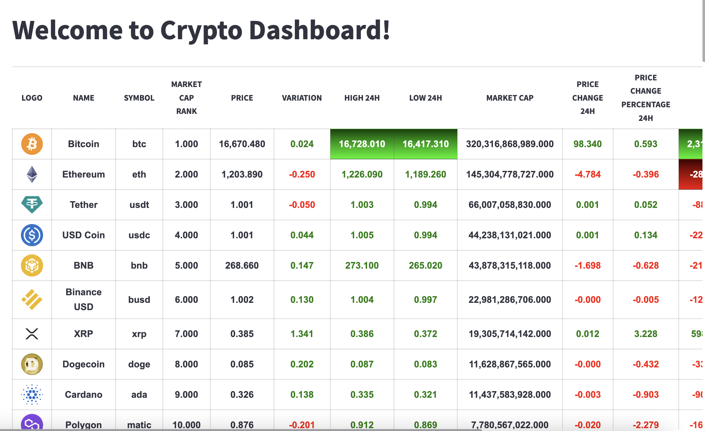
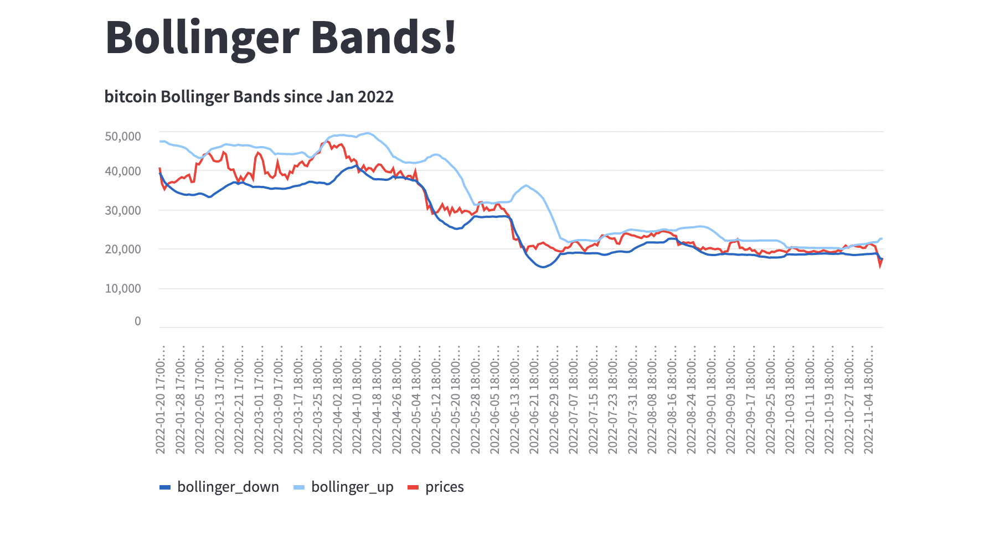
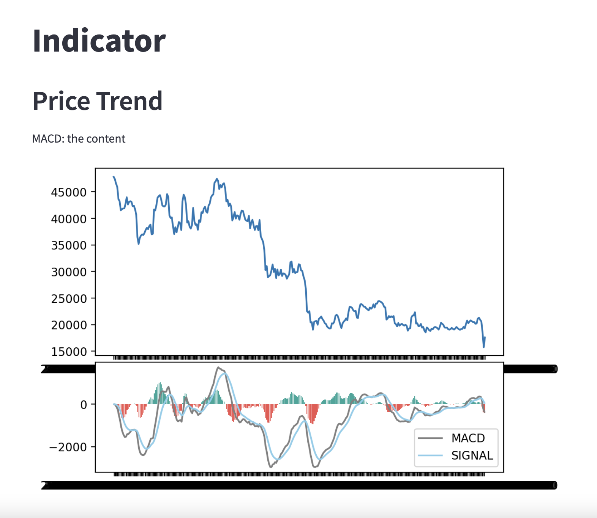

# crypto_dashboard_multipage


This project creates a dashboard for cryptocurrency data. It is meant to be simple and straight-forward for users new to crypto investing. The dashboard is easy to navigate and provides the user with a quick look at price data, trade indicators and exchange prices.  It is meant to educate as well as inform, so there are additional tabs for explanation if indicator and exchange significance.

1. Timely data on the top 10 coins is collected and displayed on the front page of the dashboard. 
2. The Coins page allows the user to choose a top-ten coin and a timeframe. With their parmaters choosen, numerical and graphical price trends are displayed. 
3. The Exchange page, posts coin prices on the top 5 exchanges. With explanations of echange strenghts and the inportance of user choice. 
4. The Notifications & Indicators pages dives deeper into common trade indictor statistics. These are used to help evaluate the coin's past performance and extrapolate potential future performace.  These statistics are followed with information expaining their significance to the new crypto enthusiast. 
5. The user can elect to receive notifications via email to tell them the "best value" exchange for their top 4 prefered coins. 


## Technologies

This project leverages python 3.7.13 with the following packages:

* [pandas](https://pandas.pydata.org/) - For data analysis
* [streamlit](https://streamlit.io/) - For creating web apps from python script

---

## Installation Guide

Before running the application first install the dependencies in conda dev environment.

```python

    conda create -n dev python=3.7 anaconda

    python -m ipykernel install --user --name dev

    conda activate dev

    pip install -r requirements.txt

    conda deactivate 
  
```

---


##  Usage

To use the **crypto_dashboard_multipage** simply clone the repository and run the **app.py** with streamlit:

```python
    conda activate dev

    streamlit run app/app.py

    conda deactivate 
```

Here are the crypto information and trend:








---
## Questions to Answer

```python
    What kind information would a "new-to_crypto" user need to know?

    Besided price trends, what criteria should we showcase for trading indicators?
    
    What metirc would a user need to evaluate buy/sell opportunities?
    
    What would a user need to know about exchanges?
    
    How do we build a user base?/ connet with users?
```

---
## Research Resources/Datasets
```python
    coingecko API - for coin data

    streamlit - for Dashboard
```
---
## Project Tasks
```python
    Kausar - main dashboard page construction with graph of at least 10 coins

    Marissa & Edith - development of the portfolio construction outline of functions

    Jodi - API data analysis and notifications sent as email alerts 
```
---

## Contributors

Kausar Hina

Marissa Gonzalas

Edith Chou

Jodi Artman

---

## License

MIT
